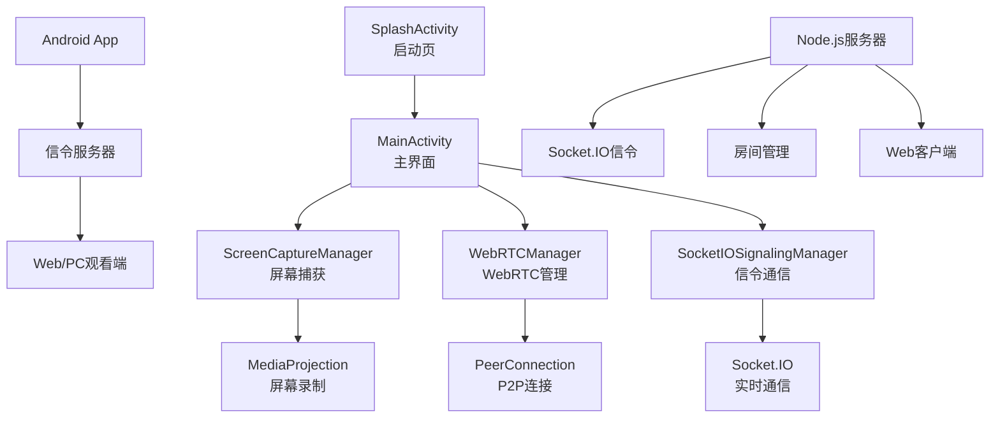

# 📱 WebRTC 投屏 - 高清实时屏幕共享应用

<div align="center">

**基于WebRTC技术的Android屏幕投屏应用**

支持1080p超高清投屏 | 自动房间获取 | 专业启动页 | 一键投屏

[](https://android.com)
[](https://webrtc.org)
[](https://kotlinlang.org)
[](LICENSE)

</div>

---

## 🌟 核心特性

### 🚀 投屏功能
- **1080p超高清投屏** - App内容模式支持1920×1080分辨率，8Mbps码率
- **双投屏模式** - 支持App内容模式和全屏模式
- **实时传输** - 基于WebRTC的低延迟P2P传输
- **自动获取房间** - 连接服务器后自动获取可用房间
- **一键刷新** - 服务器重启后可手动刷新房间

### 🎨 用户体验
- **专业启动页** - 3秒动画启动页，渐变背景+Logo动画
- **Material Design 3** - 现代化界面设计
- **自定义Logo** - 投屏主题图标设计
- **状态实时显示** - 连接状态、投屏状态一目了然
- **错误友好提示** - 清晰的错误信息和解决建议

### 🔧 技术优势
- **硬件加速编码** - 优先使用硬件编解码器
- **自适应码率** - 根据网络状况动态调整
- **安全传输** - WebRTC内置DTLS/SRTP加密
- **自动重连** - 网络异常时智能重连
- **资源优化** - 及时释放资源，优化电池使用

---

## 📱 应用截图

### 启动页
- 渐变蓝色背景
- Logo缩放动画效果
- 加载进度指示器
- 3秒自动跳转

### 主界面
- 连接状态卡片
- 房间信息管理
- 投屏控制按钮
- 实时状态监控

### 功能按钮
- 🔄 刷新房间 - 重新获取可用房间
- 📋 复制房间ID - 一键复制分享
- ▶️ 开始投屏 - 一键启动投屏
- ⏹️ 停止投屏 - 安全停止投屏

---

## 🏗️ 系统架构



---

## ⚙️ 配置参数

### 🎥 视频配置（已优化）
```kotlin
object VideoConfig {
    // App内容模式 - 1080p超高清
    const val DEFAULT_WIDTH = 1920        // 1080p宽度
    const val DEFAULT_HEIGHT = 1080       // 1080p高度
    const val DEFAULT_FPS = 30           // 30帧流畅体验
    const val DEFAULT_BITRATE = 8000     // 8Mbps超高清码率
    
    // 全屏模式 - 1080p
    const val FULLSCREEN_WIDTH = 1920
    const val FULLSCREEN_HEIGHT = 1080
    const val FULLSCREEN_FPS = 30
    const val FULLSCREEN_BITRATE = 8000
}
```

### 🔊 音频配置
```kotlin
object AudioConfig {
    const val SAMPLE_RATE = 48000        // 48kHz采样率
    const val CHANNELS = 1               // 单声道
    const val BITRATE = 128             // 128kbps码率
    const val CODEC = "opus"            // Opus编码器
}
```

### 🌐 服务器配置
```kotlin
object ServerConfig {
    const val DEFAULT_SERVER = "192.168.31.121:3000"  // 默认服务器
    const val CONNECTION_TIMEOUT = 10000L              // 连接超时
    const val RECONNECT_INTERVAL = 5000L              // 重连间隔
}
```

---

## 🚀 快速开始

### 📋 环境要求
- **Android Studio**: Hedgehog+ (2023.1.1+)
- **Android SDK**: API 24+ (Android 7.0+)
- **Kotlin**: 1.9.0+
- **Gradle**: 8.0+
- **设备要求**: Android 7.0+，建议2GB+内存

### 🔧 项目设置

1. **克隆项目**
```bash
git clone https://github.com/your-repo/webrtc-screen-share.git
cd webrtc-screen-share
```

2. **配置服务器地址**
在 `MainActivity.kt` 中修改服务器地址：
```kotlin
private var serverUrl by mutableStateOf("你的服务器IP:3000")
```

3. **构建项目**
```bash
./gradlew build
```

4. **安装到设备**
```bash
./gradlew installDebug
```

### 🖥️ 信令服务器部署

1. **启动信令服务器**
```bash
cd signaling-server
npm install
npm start
```

2. **启动Web客户端**
```bash
cd web-client
# 使用任意HTTP服务器，如：
python -m http.server 8080
# 或
npx serve .
```

---

## 📖 详细使用说明

### 🎯 投屏流程

#### 1. 应用启动
- 点击应用图标
- 观看3秒专业启动页
- 自动跳转到主界面

#### 2. 自动连接
- 应用自动连接信令服务器
- 自动获取可用房间号
- 显示房间信息

#### 3. 开始投屏
- 点击"开始投屏"按钮
- 选择投屏模式：
  - **App内容超高清模式**: 仅投屏应用内容区域
  - **全屏模式**: 投屏整个屏幕
- 授予屏幕录制权限（全屏模式）
- 投屏开始

#### 4. 观看投屏
- 在Web端打开: `http://服务器IP:8080`
- 输入房间号
- 点击"加入房间"观看

#### 5. 停止投屏
- 点击"停止投屏"按钮
- 自动清理所有连接和资源

### 🔄 房间管理

#### 自动获取房间
- 应用启动时自动获取
- 连接服务器后2秒自动获取
- 无需手动操作

#### 手动刷新房间
- 点击房间ID右侧的🔄刷新按钮
- 适用于服务器重启后
- 立即获取新的可用房间

#### 复制房间ID
- 点击房间ID右侧的📋复制按钮
- 自动复制到剪贴板
- 方便分享给观看者

---

## 🔒 权限说明

### 必需权限
| 权限 | 用途 | 说明 |
|------|------|------|
| `INTERNET` | 网络通信 | 连接信令服务器和WebRTC通信 |
| `ACCESS_NETWORK_STATE` | 网络状态 | 检查网络连接状态 |
| `ACCESS_WIFI_STATE` | WiFi状态 | 优化WiFi环境下的传输 |
| `FOREGROUND_SERVICE` | 前台服务 | 保持投屏服务运行 |
| `FOREGROUND_SERVICE_MEDIA_PROJECTION` | 媒体投影 | 屏幕录制服务 |

### 可选权限
| 权限 | 用途 | 说明 |
|------|------|------|
| `RECORD_AUDIO` | 音频录制 | 传输系统音频（可选） |
| `POST_NOTIFICATIONS` | 通知显示 | Android 13+通知权限 |
| `WAKE_LOCK` | 保持唤醒 | 防止投屏时息屏 |
| `CAMERA` | 相机访问 | 未来功能扩展 |

---

## 🐛 故障排除

### 常见问题及解决方案

#### 🔴 无法连接服务器
**症状**: 信令状态显示"未连接"或"连接错误"
**解决方案**:
1. 检查服务器地址是否正确
2. 确认服务器是否正常运行
3. 检查网络连接
4. 确认防火墙设置

#### 🔴 无法获取房间
**症状**: 房间ID显示"未设置"
**解决方案**:
1. 点击🔄刷新按钮重新获取
2. 检查服务器API是否正常
3. 重启应用重新连接

#### 🔴 屏幕录制权限被拒绝
**症状**: 全屏模式无法启动
**解决方案**:
1. 在系统设置中手动授予权限
2. 重启应用重新请求权限
3. 使用App内容模式替代

#### 🔴 投屏质量差/卡顿
**症状**: 画面模糊、延迟高、卡顿
**解决方案**:
1. 检查网络带宽（建议10Mbps+）
2. 切换到WiFi网络
3. 关闭其他占用网络的应用
4. 降低投屏分辨率

#### 🔴 连接频繁断开
**症状**: 投屏过程中频繁中断
**解决方案**:
1. 检查网络稳定性
2. 确保设备不进入省电模式
3. 关闭应用后台清理
4. 重启路由器

### 📊 性能优化建议

#### 网络环境
- **推荐**: WiFi 5GHz频段
- **最低**: 4G网络，信号良好
- **带宽**: 上行10Mbps+，下行5Mbps+

#### 设备性能
- **推荐**: 8核CPU，4GB+内存
- **最低**: 4核CPU，2GB内存
- **系统**: Android 8.0+

#### 使用建议
- 投屏时保持设备充电
- 关闭不必要的后台应用
- 使用飞行模式+WiFi减少干扰
- 定期清理应用缓存

---

## 🔧 开发者指南

### 📁 项目结构
```
app/src/main/java/com/example/webrtc/
├── MainActivity.kt              # 主界面Activity
├── SplashActivity.kt           # 启动页Activity
├── config/
│   └── WebRTCConfig.kt         # 配置文件
├── manager/
│   ├── ScreenCaptureManager.kt # 屏幕捕获管理
│   ├── WebRTCManager.kt        # WebRTC连接管理
│   └── SocketIOSignalingManager.kt # 信令通信管理
├── model/
│   └── [数据模型类]
└── ui/
    └── theme/                  # UI主题配置
```

### 🎨 自定义配置

#### 修改投屏参数
```kotlin
// 在WebRTCConfig.kt中修改
object Video {
    const val DEFAULT_WIDTH = 1920     // 修改分辨率
    const val DEFAULT_HEIGHT = 1080
    const val DEFAULT_FPS = 30         // 修改帧率
    const val DEFAULT_BITRATE = 8000   // 修改码率
}
```

#### 修改服务器地址
```kotlin
// 在MainActivity.kt中修改
private var serverUrl by mutableStateOf("新的服务器地址:端口")
```

#### 自定义UI主题
```kotlin
// 在ui/theme/目录下修改颜色和主题
```

### 🔍 调试技巧

#### 查看日志
```bash
# 查看应用日志
adb logcat | grep "WebRTC\|ScreenCapture\|Signaling"

# 过滤错误日志
adb logcat *:E | grep "com.example.webrtc"

# 实时监控
adb logcat -c && adb logcat | grep "WebRTC"
```

#### 性能监控
```bash
# CPU使用率
adb shell top | grep com.example.webrtc

# 内存使用
adb shell dumpsys meminfo com.example.webrtc

# 网络流量
adb shell cat /proc/net/dev
```

---

## 📄 版本历史

### 🎉 v2.0.0 (当前版本)
- ✅ **1080p超高清投屏** - App内容模式升级到1920×1080
- ✅ **专业启动页** - 3秒动画启动页，提升用户体验
- ✅ **自定义Logo** - 投屏主题图标设计
- ✅ **自动获取房间** - 连接服务器后自动获取可用房间
- ✅ **刷新房间功能** - 手动刷新按钮，解决服务器重启问题
- ✅ **删除新建房间** - 简化操作流程
- ✅ **界面优化** - Material Design 3，现代化设计

### 📋 v1.0.0 (基础版本)
- ✅ 基础屏幕投屏功能
- ✅ WebRTC P2P连接
- ✅ 信令服务器通信
- ✅ 权限管理
- ✅ 自动重连机制

### 🔮 计划功能 (v3.0.0)
- 🔄 多用户同时观看
- 🎮 远程控制功能
- 📊 性能监控面板
- 🎨 自定义主题切换
- 📱 横屏模式支持
- 🔊 音频传输优化
- 📹 录制功能

---

## 🤝 贡献指南

### 参与贡献
欢迎提交Issue和Pull Request来帮助改进项目！

### 开发流程
1. **Fork项目** - 点击右上角Fork按钮
2. **创建分支** - `git checkout -b feature/新功能`
3. **提交代码** - `git commit -m "添加新功能"`
4. **推送分支** - `git push origin feature/新功能`
5. **创建PR** - 在GitHub上创建Pull Request

### 代码规范
- 使用Kotlin编程语言
- 遵循Android开发最佳实践
- 添加必要的注释和文档
- 确保代码通过Lint检查

---

## 📞 技术支持

### 获取帮助
- 📋 **问题反馈**: [GitHub Issues](https://github.com/your-repo/issues)
- 💡 **功能建议**: 通过Issue提交新功能建议
- 💬 **技术讨论**: [GitHub Discussions](https://github.com/your-repo/discussions)
- 📧 **邮件联系**: your-email@example.com

### 常用链接
- 🌐 **项目主页**: https://github.com/your-repo/webrtc-screen-share
- 📖 **Wiki文档**: https://github.com/your-repo/webrtc-screen-share/wiki
- 🚀 **发布页面**: https://github.com/your-repo/webrtc-screen-share/releases

---

## 📄 开源协议

本项目基于 [MIT License](LICENSE) 开源协议发布。

---

<div align="center">

**⭐ 如果这个项目对你有帮助，请给个Star支持一下！**

**🔔 Watch本项目获取最新更新通知**

**🍴 Fork项目开始你的定制开发**

---

*Made with ❤️ by WebRTC投屏团队*

</div> 